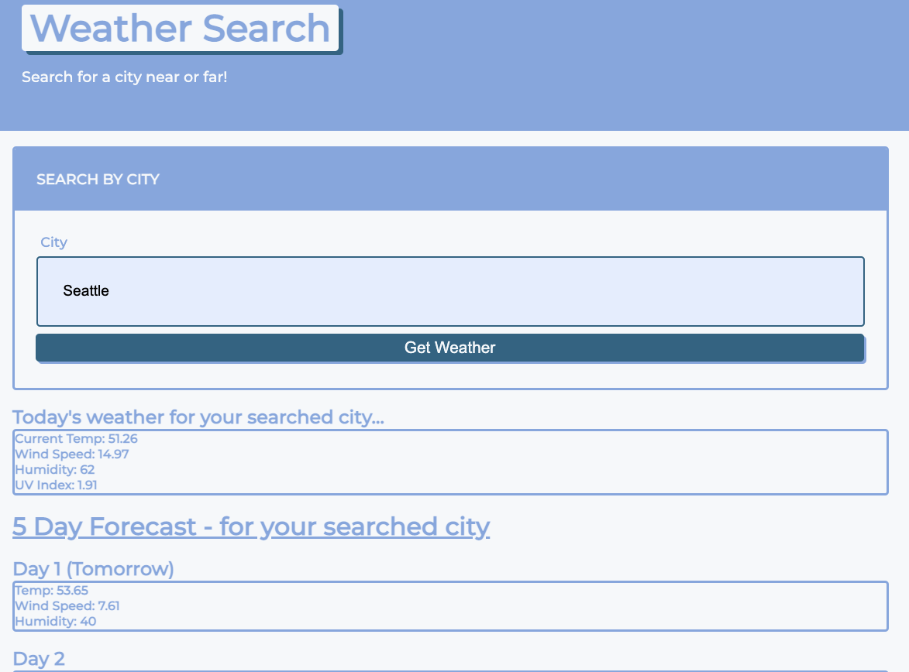

# Weather App
## <Project Weather App>

## Table of Contents 

* [Description](#description)

* [LinkToSite](#LinkToSite)

* [Questions](#questions)

## Description
We were tasked this week with creating a searchable weather site where you type in the city and the result populates with a 5 day forecast. We were to use a weather API (I used openweathermap) to pull the data. I was able to successfully pull the current days weather for a given city. I ran into some issues trying to get the future weather. I will continue to work on this to gain more knowledge on how to pull the future information. I also created links for default cities but ran out of time to get those links to fully function. Thank you!

## Link to github: <https://github.com/jennyrae818/weatherapp>

## LinkToSite
<https://jennyrae818.github.io/weatherapp/>

## Questions

If you have any questions about the repo, open an issue or contact [jenny](undefined) directly at jennyrae818@gmail.com.